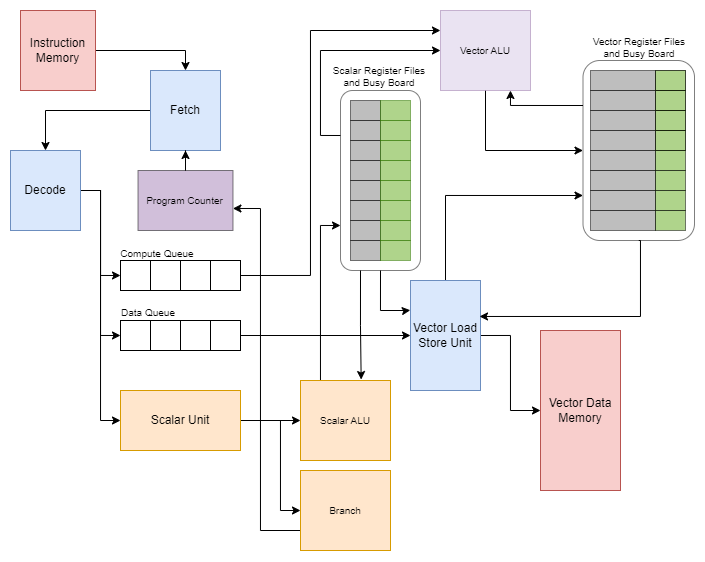
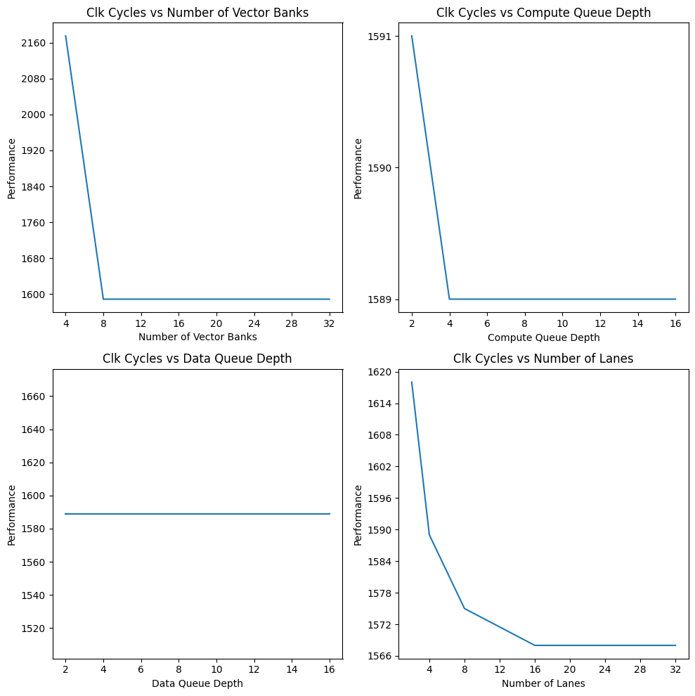
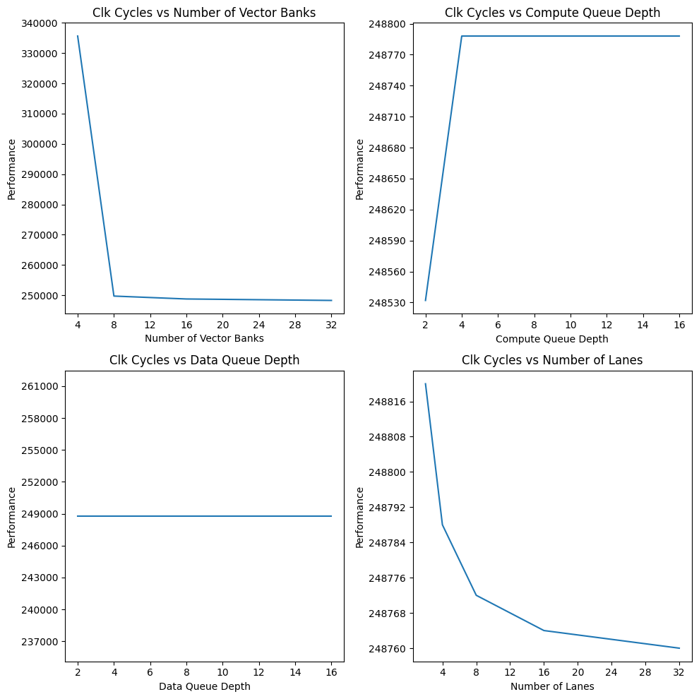

# VMIPS-Functional-Timing-Simulator
The repo presents the VMIPS architecture, a high-performance processor architecture for embedded systems, and the development of both a functional simulator and a timing simulator to aid in the development and testing of assembly code for this architecture. The functional simulator allows for the testing and evaluation of a virtual implementation of the MIPS instruction set without the need for actual hardware, while the timing simulator provides a realistic simulation of the performance of the VMIPS architecture. The article also provides a detailed description of the methodology used in the timing simulator, including the fetch and decode block, dispatch queue, computational pipeline, and vector load store unit. By using the simulators, developers can identify and resolve issues in assembly code prior to actual hardware implementation, improving the efficiency and reliability of the development process.



### To run functional simulator use,
```
FunctionalSimulator/main.py --iodir InputOutputDirectory
```


### To run timing simulator use,
```
TimingSimulator/main.py --iodir InputOutputDirectory
```

#### Note: To run the Timing simulator, the Functional Simulator outputs resolvedData.txt, which needs to be placed in the input output directory of the timing simulator and renamed to Data.txt.

## Performace trends observed using the simulator.
### For dot product of two vectors with length 450  


<h3>For a single FC layer</h3>



